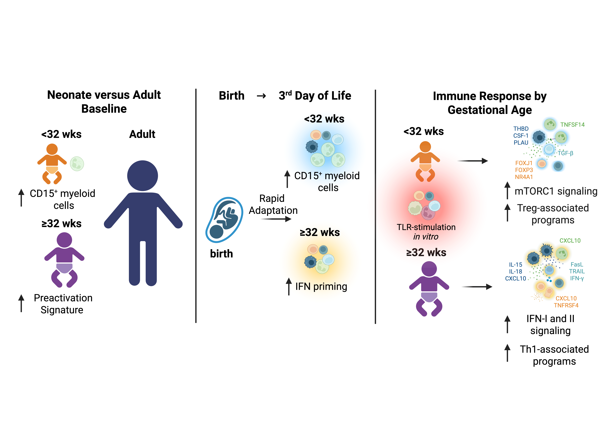

# Neonatal CITE-seq atlas

Customized code related to **"Human neonatal CITE-seq atlas identifies an immune transition at 32 weeks’ gestation from CD15⁺ myeloid-dominated to interferon-primed immunity"**

🔗 Preprint: https://www.biorxiv.org/content/10.64898/2026.04.01.715643v1

---

## Graphical Abstract 


---

## Abstract
The human neonatal immune system is developmentally specialized to balance the unique requirements of perinatal transition. Disruption of this finely tuned balance, as in preterm birth, may have profound consequences for immunity and overall health. However, the impact of prematurity on immune composition and functional responsiveness across gestational ages (GA) remains incompletely understood. Single-cell profiling has advanced our understanding of neonatal immunity, yet most studies were limited to unimodal readouts, narrow GA windows, or baseline function. Here, we present a comprehensive human neonatal CITE-seq atlas (82 samples from 25 neonates and 10 adults as controls) at the first days of life covering a wide GA range and integrating baseline and stimulated conditions. Most notably, we identify a GA-dependent immune transition point centering around 32 weeks of GA, which discriminates extremely and very preterm neonates (GA <32wks) from those of higher GA (≥32wks). In particular, early-life immunity in extremely and very preterm infants showed CD15+ granulocytic myeloid derived suppressor cell-like predominance, whereas more mature neonates exhibited interferon-primed transcriptional profiles. This was associated with divergent myeloid-to-lymphocyte signaling networks and qualitatively distinct NK- and T-cell bystander responses upon activation. Together, these findings show that intrauterine development imprints GA-specific immune programs. By defining a developmental transition around a GA of 32 weeks that regulates baseline and induced responses of neonatal immune cells, our atlas provides a framework for understanding the vulnerability of preterm infants and thus may pave the way for developing GA-adapted immunomodulatory strategies.

---

## Data and Materials Availability

All code and data associated with this study are present in the paper, the Supplementary Materials, or as indicated below:  

- **Interactive exploration and download will be possible via:** [CELLxGENE portal](https://cellxgene.cziscience.com/)  
- **Raw and processed CITE-seq data matrices will be available at:** [Gene Expression Omnibus (GEO)](https://www.ncbi.nlm.nih.gov/geo/query/acc.cgi?acc=GSEXXXXX)  
- **Custom scripts for analysis and visualization:** available in this repository

All other analyses were performed using publicly available software packages as described in the Methods section of the manuscript.

---

## Requirements

The analysis was performed in R using the following packages:

```r
install.packages(c("ggplot2", "dplyr", "tidyr", "ggrepel", "forcats", "tibble",
                   "Matrix", "pheatmap", "svglite", "ggpattern", "hdf5r"))

if (!require("BiocManager", quietly = TRUE))
    install.packages("BiocManager")
BiocManager::install(c("Seurat", "DESeq2", "enrichR"))

remotes::install_github("satijalab/MuDataSeurat")
```

---

## Scripts

This repository contains the following analysis and visualization scripts:

- `PCAplot.R` — Loads the multimodal H5MU object, aggregates RNA expression by sample, performs PCA, and generates a sample-level PCA plot.
- `Pheatmap.R` — Creates heatmaps of selected marker genes stratified by gestational age.
- `StackedBarPlot_cellproportions.R` — Visualizes cell type proportions across gestational age groups using stacked bar plots.
- `ndensPlot.R` — Produces normalized density UMAP plots for selected sample groups and cell types.
- `DEGs_Analysis_Visualization.R` — Performs age-stratified and interaction-based differential expression analyses, enrichment testing, and downstream DEG visualizations.
